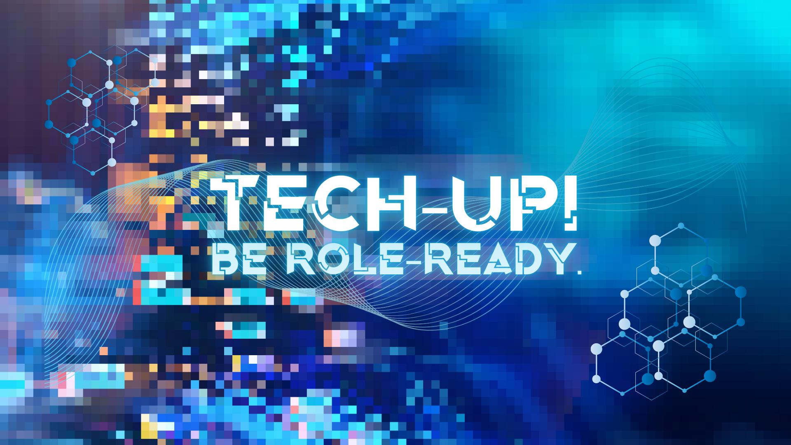

# 🛠️ Tech-Up!  
## 📌 Overview  
A technology-focused workshop series where participants learn **essential developer tools beyond coding**.  
From mastering IDEs to version control with **Git & GitHub** and navigating the **CLI**,  
Tech-Up! equips coders with **must-have skills for real-world development**.  

---

## 🎯 Objectives  
- Introduce participants to **industry-standard developer tools**  
- Build confidence in using **command-line interfaces and IDEs**  
- Teach **version control best practices** with Git & GitHub  
- Enhance participants’ ability to **collaborate and work efficiently** in real projects  

---

## 📚 Topics  
- **Integrated Development Environments (IDEs)** – Setup, extensions, productivity tips  
- **Command Line Interface (CLI)** – Navigation, commands, scripting basics  
- **Version Control with Git** – Branching, merging, conflict resolution  
- **Collaboration with GitHub** – Pull requests, issues, project boards  
- **Developer Workflow** – Toolchains, automation, best practices  

---

## 📋 Event Details  
- **Type of Event:** Workshop · Series (Individual Participation)  
- **Level:** Beginner → Intermediate  